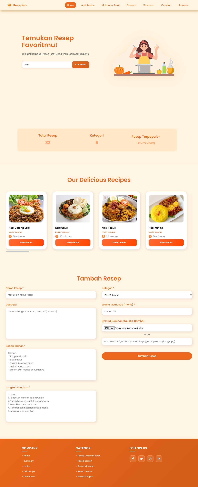
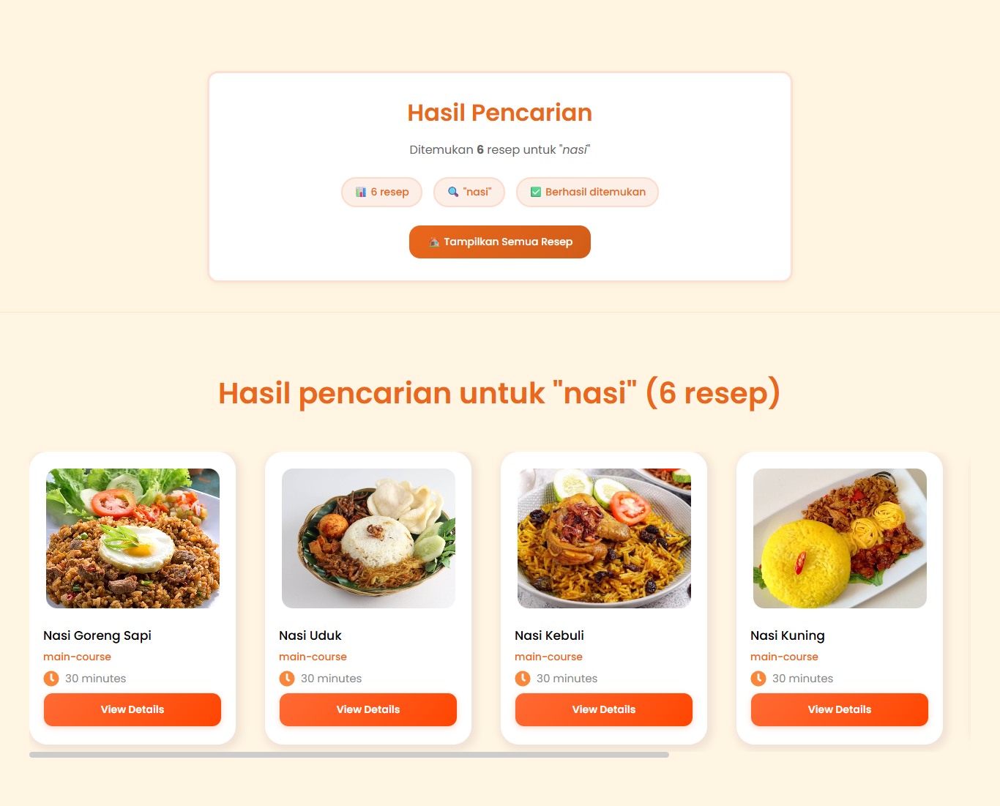
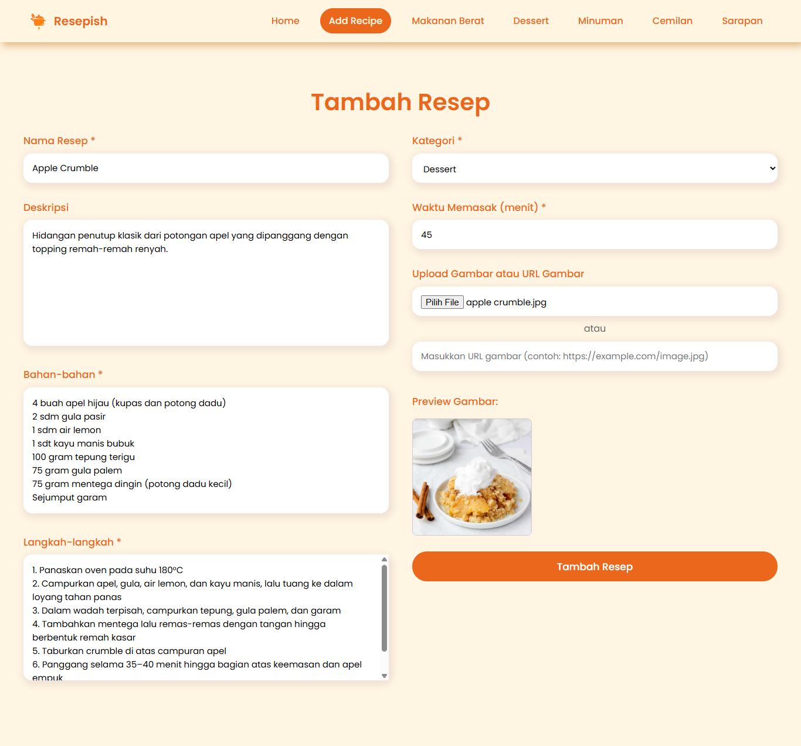
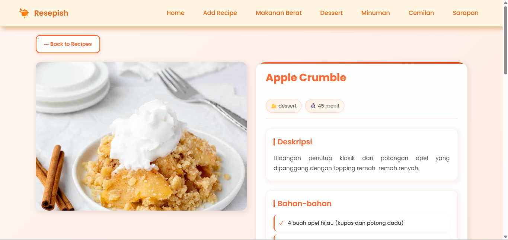
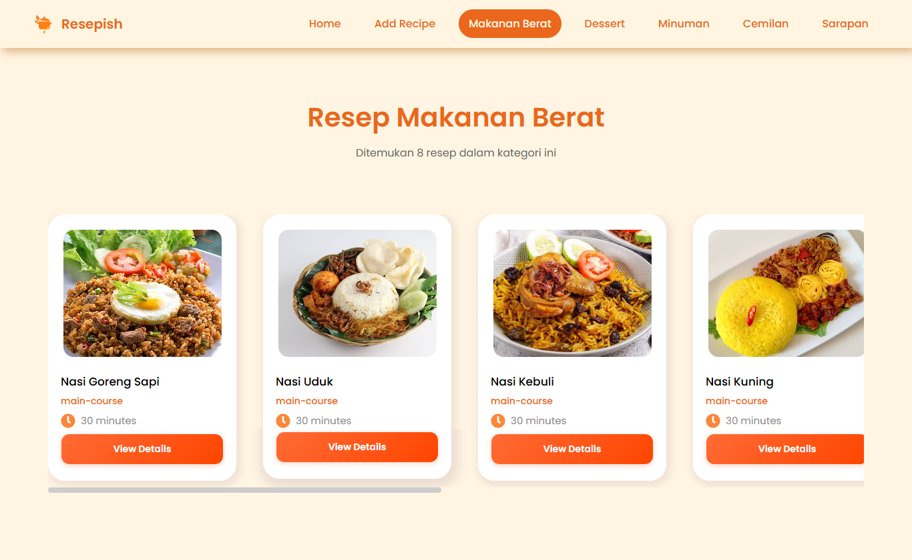
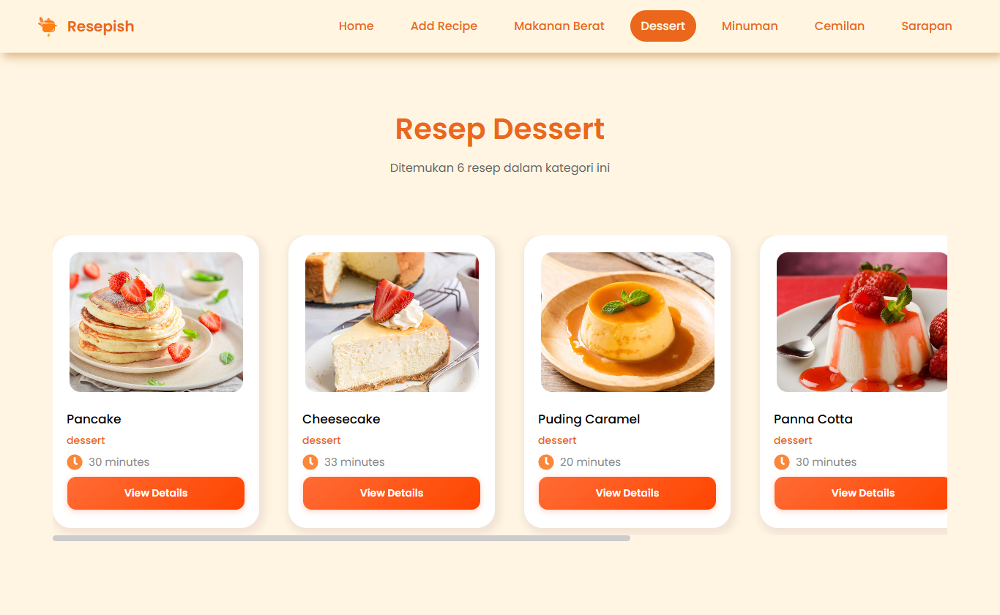
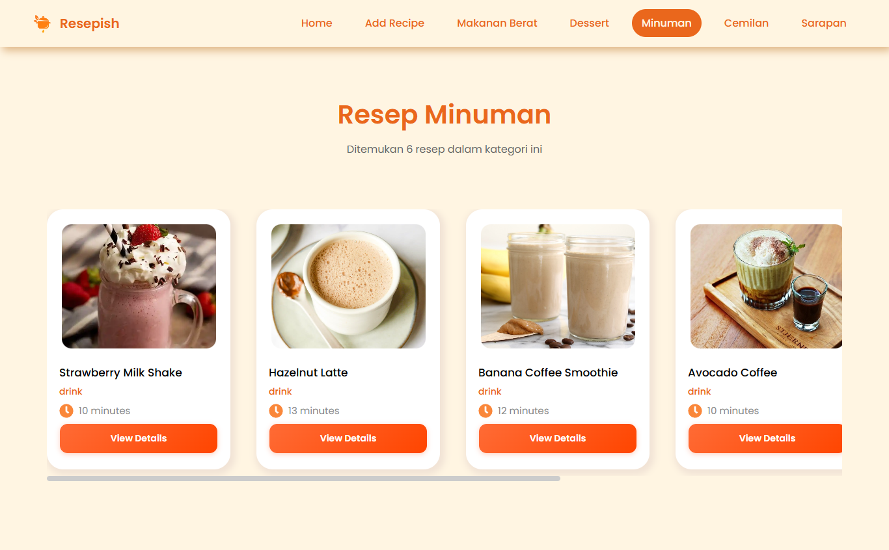
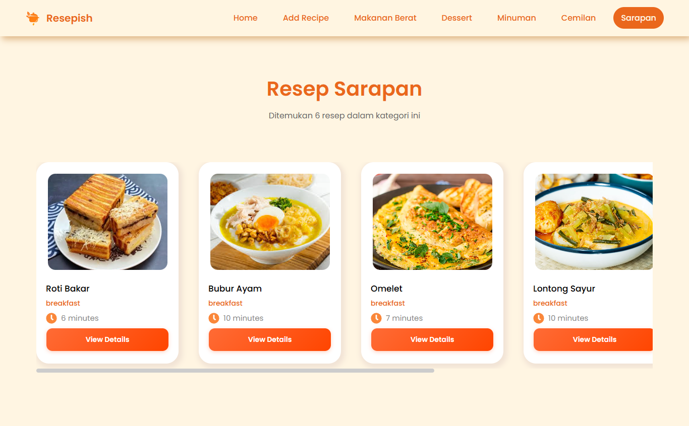

# 🥘 Resepish – Aplikasi Web Resep Masakan Interaktif

**Resepish** adalah aplikasi web interaktif yang memudahkan pengguna dalam mencari, menjelajahi, dan menambahkan resep masakan dari berbagai kategori seperti **Makanan Berat, Dessert, Minuman, dan Cemilan**. Aplikasi ini dirancang dengan antarmuka yang bersih, responsif, dan modern menggunakan ReactJS, serta tersambung ke backend Supabase untuk pengelolaan data.

## 🚀 Fitur Utama

- 📂 Menampilkan daftar resep berdasarkan kategori.
- 🔍 Pencarian resep secara real-time (berdasarkan judul).
- 📝 Form interaktif untuk menambahkan resep baru.
- 🖼️ Preview gambar resep sebelum diunggah.
- 🧮 Statistik ringkas jumlah total resep, kategori, dan terpopuler.
- 📱 Responsive: mendukung layout Desktop, Tablet, dan Mobile.
- 🔁 Integrasi langsung dengan database Supabase (CRUD).

## 🛠️ Teknologi yang Digunakan

- **Frontend**: React.js (v18.2.0)
- **Build Tool**: Vite
- **State Management**: React Context API & Hooks
- **Styling**: CSS Modules + Global CSS
- **Routing**: react-router-dom
- **Database & API**: Supabase (PostgreSQL)
- **Icons**: react-icons
- **Font**: Google Fonts (Poppins)

## 📂 Struktur Folder

```bash

├── public/
├── src/
│   ├── assets/
│   ├── components/
│   │   ├── AddRecipeForm/
│   │   ├── Footer/
│   │   ├── Hero/
│   │   ├── Navbar/
│   │   ├── RecipeCard/
│   │   ├── RecipeList/
│   │   ├── Summary/
│   ├── context/
│   │   └── RecipeProvider.jsx
│   ├── hooks/
│   │   ├── useRecipes.js
│   │   └── useCategory.js
│   ├── layout/
│   │   ├── Navbar.jsx
│   │   └── Footer.jsx
│   ├── lib/
│   │   └── supabase.js
│   ├── pages/
│   │   ├── Home/
│   │   ├── AddRecipe/
│   │   ├── Category/
│   │   ├── RecipeDetail/
│   │   └── Search/
│   ├── services/
│   │   └── recipeService.js
│   ├── App.jsx
│   ├── main.jsx
│   └── index.html
```

## 📸 Tampilan Aplikasi

### 🏠 Halaman Beranda  
Menampilkan hero, statistik resep, dan daftar resep utama.  


### 🔍 Hasil Pencarian  
Menampilkan hasil resep berdasarkan kata kunci secara real-time.  


### 📝 Form Tambah Resep  
Formulir untuk menambahkan resep baru ke dalam database.  


### 🍲 Detail Resep  
Menampilkan detail resep secara lengkap berdasarkan ID resep.  


### 🍛 Kategori: Makanan Berat  


### 🍮 Kategori: Dessert  


### 🥤 Kategori: Minuman  


### 🍳 Kategori: Sarapan  



## 🧪 Status Pengembangan
| Fitur               | Status | Keterangan                                                  |
|---------------------|--------|-------------------------------------------------------------|
| 🔍 Pencarian        | ✅    | Sudah berjalan real-time berbasis keyword                   |
| 📋 Detail Resep     | ✅    | Menampilkan semua informasi lengkap dari Supabase           |
| 🧾 Tambah Resep     | ✅    | Upload + preview + menyimpan ke database secara realtime    |
| 🛡️ Validasi Form    | ✅    | Validasi dasar tersedia, namun belum semua bersifat wajib   |

## 👩‍💻 Tentang Pengembang

Proyek ini dikembangkan untuk memenuhi Ujian Akhir Semester (UAS) mata kuliah **Pemrograman Frontend**.

**Pengembang**:  
🧑‍💻 *Fatiya Labibah*  
🎓 *NIM 0110223060*  
🏫 *STT Terpadu Nurul Fikri*  
📅 *Tahun Akademik 2025*
